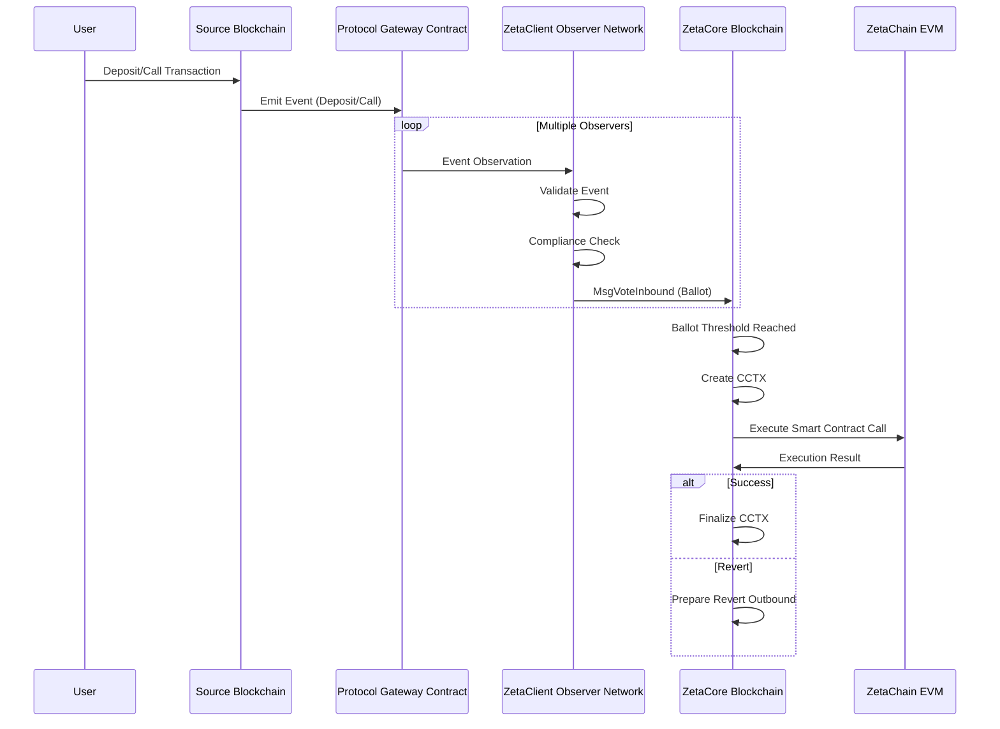
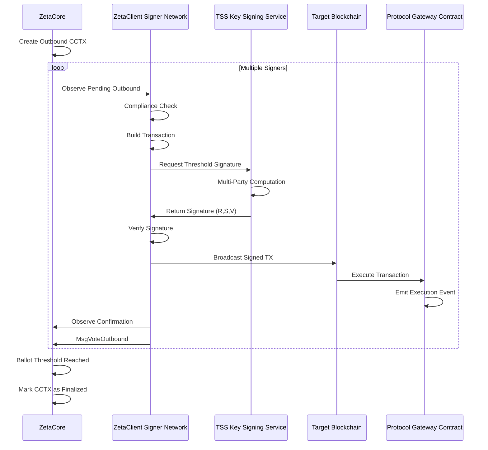
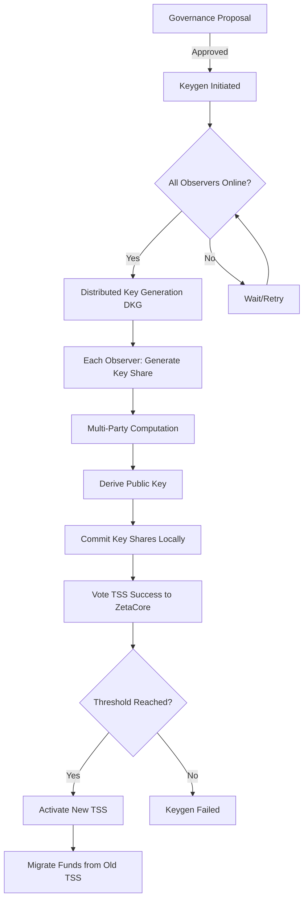
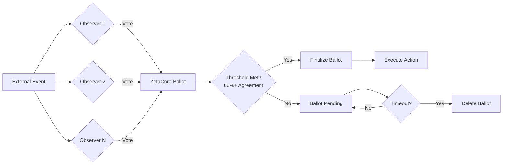

# ZetaChain: Security Architecture Analysis

## Executive Summary

ZetaChain is a sophisticated omnichain blockchain platform that enables cross-chain smart contract execution and messaging between disparate blockchain networks. The system consists of two primary components: **ZetaCore** (a Cosmos SDK-based L1 blockchain) and **ZetaClient** (a distributed observer and signer network). This document provides a comprehensive security analysis of the platform's architecture, data flows, and threat model.

**Platform Version Analyzed:** v36.0.0 (ZetaCore), v37.0.0 (ZetaClient)  
**Analysis Date:** 2025-11-10  
**Classification:** Security Critical Infrastructure

---

## 1. System Architecture Overview

### 1.1 Core Components

ZetaChain's architecture consists of three primary layers:

#### Layer 1: ZetaCore (Blockchain Layer)
- **Technology Stack:** Cosmos SDK v0.50.x, CometBFT consensus
- **Purpose:** Consensus, state management, cross-chain transaction coordination
- **Key Modules:**
  - `crosschain`: CCTX (Cross-Chain Transaction) lifecycle management
  - `observer`: TSS key management, observer set coordination
  - `fungible`: ZRC-20 token management and gas abstraction
  - `emissions`: Block rewards and fee distribution
  - `authority`: Governance and authorization policies

#### Layer 2: ZetaClient (Observer-Signer Network)
- **Technology Stack:** Go, libp2p for P2P, go-tss for threshold signatures
- **Purpose:** External blockchain observation, TSS signing, transaction broadcasting
- **Key Responsibilities:**
  - Monitor connected blockchains for deposits/events
  - Vote on inbound transactions via CCTX ballots
  - Sign outbound transactions using TSS
  - Report gas prices and blockchain state

#### Layer 3: Protocol Contracts
- **EVM Chains:** Gateway contracts, ZetaConnector, ERC20Custody
- **Solana:** Gateway program with SPL token support
- **Sui:** Gateway package with Move smart contracts  
- **TON:** Gateway smart contracts

### 1.2 Supported Blockchain Integrations

**Current Production Support:**
- **Bitcoin:** Mainnet, Testnet, Signet, Testnet4, Regnet
- **EVM Chains:** Ethereum, BSC, Polygon, Avalanche, Arbitrum, Optimism, Base, Goerli, Sepolia
- **Solana:** Mainnet, Devnet
- **Sui:** Mainnet, Testnet
- **TON:** Mainnet, Testnet

---

## 2. Data Flow Architecture

### 2.1 Cross-Chain Transaction Flow (Inbound)



### 2.2 Cross-Chain Transaction Flow (Outbound)



### 2.3 TSS Key Generation Flow



### 2.4 Observer Consensus and Voting



---

## 3. Security Model

### 3.1 Trust Assumptions

**Byzantine Fault Tolerance:**
- ZetaCore consensus requires 67% honest validators (CometBFT BFT)
- ZetaClient observer voting requires 67% threshold for ballot finalization
- TSS signing requires threshold (t-of-n) signature scheme

**Key Trust Boundaries:**
1. **Validator Set:** Must be Byzantine resistant (>2/3 honest)
2. **Observer Set:** Must have majority honest observers
3. **TSS Participants:** Must protect key shares; threshold (t) must not collude
4. **External RPC Nodes:** Assumed to provide valid blockchain data (mitigated by multiple observers)
5. **Protocol Contracts:** Must be correctly implemented and not upgradeable by malicious actors

### 3.2 Threat Model

#### 3.2.1 Threat Actors

| Actor | Capability | Motivation |
|-------|-----------|------------|
| External Attacker | Network access, smart contract interaction | Financial gain, DoS |
| Malicious Observer | Node operator with observer credentials | Manipulate votes, steal funds |
| Compromised Validator | Validator node access | Consensus manipulation |
| Insider Threat | Development/operations access | Sabotage, theft |
| Nation State | Advanced persistent threat | Disruption, intelligence |

#### 3.2.2 Attack Vectors

**A. Cross-Chain Attack Vectors**

1. **Double-Spend Attacks**
   - **Threat:** Attacker deposits on source chain, receives on ZEVM, then causes reorg on source chain
   - **Mitigation:** Confirmation thresholds (6+ for Bitcoin, varies by chain)
   - **Residual Risk:** LOW - confirmation counts are configurable and conservative

2. **Signature Replay Attacks**
   - **Threat:** Reuse signed TSS transactions across chains or after key rotation
   - **Mitigation:** Chain ID binding, nonce management, unique tx hashes
   - **Residual Risk:** VERY LOW - strong cryptographic protections

3. **Front-Running / MEV**
   - **Threat:** Observers or validators can see pending transactions and front-run users
   - **Mitigation:** Limited - ZetaCore uses priority mempool but no MEV protection
   - **Residual Risk:** MEDIUM - inherent to blockchain design

4. **Ballot Stuffing**
   - **Threat:** Attacker controls >33% observers to push through false inbound votes
   - **Mitigation:** Observer set governance, staking requirements, slashing
   - **Residual Risk:** MEDIUM - depends on governance process

**B. TSS-Specific Attack Vectors**

5. **TSS Key Extraction**
   - **Threat:** Compromise t+ observers to reconstruct private key
   - **Mitigation:** Secure key storage, HSM support (deprecated), encrypted key shares
   - **Residual Risk:** HIGH - if t+ nodes compromised, funds are lost

6. **Denial of Service on TSS**
   - **Threat:** Malicious observer refuses to participate in signing, blocking outbounds
   - **Mitigation:** Blame mechanism, observer rotation, timeout handling
   - **Residual Risk:** MEDIUM - can temporarily block transactions

7. **TSS Migration Exploits**
   - **Threat:** During TSS key rotation, attacker manipulates fund migration
   - **Mitigation:** Multi-step migration process, governance controls
   - **Residual Risk:** MEDIUM - complex migration process increases attack surface

**C. Smart Contract Attack Vectors**

8. **Gateway Contract Exploits**
   - **Threat:** Vulnerability in protocol contracts allows unauthorized withdrawals
   - **Mitigation:** Audits, formal verification, pausability mechanisms
   - **Residual Risk:** MEDIUM - contract complexity creates risk

9. **Revert/Abort Logic Exploits**
   - **Threat:** Manipulate revert conditions to cause stuck funds or unauthorized refunds
   - **Mitigation:** Strict validation, compliance checks, abort workflows
   - **Residual Risk:** MEDIUM - complex revert logic is error-prone

**D. Operational Attack Vectors**

10. **RPC Node Manipulation**
    - **Threat:** Attacker controls RPC endpoints to feed false blockchain data
    - **Mitigation:** Multiple observers, cross-validation, RPC health checks
    - **Residual Risk:** LOW - redundancy provides protection

11. **Observer Liveness Attacks**
    - **Threat:** Attacker DoS attacks observer nodes to halt cross-chain operations
    - **Mitigation:** Geographic distribution, rate limiting, DDoS protection
    - **Residual Risk:** MEDIUM - infrastructure-dependent

12. **Hot Key Draining**
    - **Threat:** Observer hot keys drain from transaction fees faster than funded
    - **Mitigation:** Burn rate monitoring, alerts, automatic refunding
    - **Residual Risk:** LOW - well monitored

### 3.3 Security Controls

#### 3.3.1 Access Controls

**Role-Based Authorization (via `authority` module):**
- **Emergency Policy Group:** Can pause CCTXs, disable chains
- **Admin Policy Group:** Can update chain parameters, contracts
- **Operational Policy Group:** Can update operational parameters
- **Validator Set:** Consensus participation
- **Observer Set:** Cross-chain observation and signing

**Authorization Matrix:**

| Action | Emergency | Admin | Operational | Observer | Validator |
|--------|-----------|-------|-------------|----------|-----------|
| Pause CCTXs | ✓ | ✗ | ✗ | ✗ | ✗ |
| Update Chain Params | ✗ | ✓ | Partial | ✗ | ✗ |
| Vote Inbound | ✗ | ✗ | ✗ | ✓ | ✗ |
| Sign Outbound | ✗ | ✗ | ✗ | ✓ | ✗ |
| Block Production | ✗ | ✗ | ✗ | ✗ | ✓ |

#### 3.3.2 Cryptographic Controls

1. **TSS Threshold Signatures**
   - Algorithm: ECDSA/EdDSA via go-tss (fork of tss-lib)
   - Threshold: Configurable t-of-n (typically 2/3)
   - Key Generation: Distributed via Gennaro-Goldfeder protocol

2. **Transaction Signing**
   - Bitcoin: P2WPKH (SegWit), P2TR (Taproot), P2PKH, P2SH support
   - EVM: EIP-155 (replay protection), EIP-1559 (gas pricing)
   - Non-EVM: Chain-specific signature schemes

3. **Message Authentication**
   - Cosmos SDK message signing via secp256k1
   - Tendermint Byzantine consensus signatures

#### 3.3.3 Input Validation

**Inbound Transaction Validation:**
```go
// Key validation checkpoints
1. Event signature verification
2. Contract address validation
3. Amount sanity checks (min/max)
4. Address format validation (checksum, network)
5. Message length limits (10KB max)
6. Compliance/restricted address checks
7. Confirmation count verification
8. Gas limit validation
```

**Outbound Transaction Validation:**
```go
// Key validation checkpoints
1. CCTX state verification
2. Nonce ordering
3. Amount vs. gas validation
4. Recipient address validation
5. TSS key verification
6. Replay protection checks
7. Transaction size limits
```

#### 3.3.4 Rate Limiting

- **TSS Signing:** Configurable max pending signatures (default: varies)
- **Inbound Observation:** Per-chain rate limits based on block times
- **Gas Price Updates:** Throttled to prevent spam
- **CCTX Creation:** Limited by block production rate

#### 3.3.5 Monitoring and Observability

**Metrics Collected:**
- Block production latency
- Hot key burn rate
- Observer/signer health
- TSS signing latency
- Cross-chain transaction success rates
- Gas price stability pool utilization
- RPC endpoint health

**Alerting Thresholds:**
- Hot key balance below threshold
- Observer node offline
- TSS keygen failures
- Unusual CCTX failure rates
- Mempool congestion

---

## 4. Key Security Features

### 4.1 Compliance and Sanctions Screening

ZetaClient implements a comprehensive compliance system:

```go
// Restricted address book loaded from config
// Reloaded automatically on file changes without restart
zetaclient_restricted_addresses.json
```

**Compliance Checks:**
- Performed on **both inbound and outbound** transactions
- Checks sender, receiver, and intermediate addresses
- Transactions involving restricted addresses are **rejected** and reverted
- Dedicated compliance logging for audit trails

**Coverage:**
- Bitcoin (sender/receiver addresses)
- EVM chains (sender/receiver addresses)
- Solana (sender/receiver accounts)
- Sui (sender/receiver addresses)
- TON (sender/receiver addresses)

### 4.2 Fee and Gas Management

**ZetaChain Gas Stability Pool:**
- Buffers gas price volatility
- Allows users to pay gas in any token
- Prevents failed outbounds due to gas price spikes

**Dynamic Gas Price Adjustment:**
- EVM: EIP-1559 support with base fee + priority fee
- Bitcoin: Fee estimation via RPC, RBF (Replace-By-Fee) support
- Safety multipliers to ensure inclusion

### 4.3 Fault Tolerance Mechanisms

**Stuck Transaction Recovery:**
- **Bitcoin RBF:** Automatic fee bumping for stuck transactions
- **EVM Gas Price Bumping:** Increase gas price for pending txs
- **Outbound Tracker:** Monitors and retries failed broadcasts

**Revert Workflows:**
- Automatic revert to source chain on execution failure
- `onRevert` and `onCall` hooks for custom error handling
- Abort workflows for dust amounts or compliance violations

### 4.4 Upgrade Safety

**ZetaCore Upgrades:**
- Cosmos SDK upgrade module with governance
- Coordinated halts at specific block heights
- Backward-compatible state migrations

**ZetaClient Upgrades:**
- Version compatibility checks with ZetaCore
- Automatic shutdown on incompatible versions
- Independent release cycles (since v37)

**Protocol Contract Upgrades:**
- Governance-controlled upgrade authority
- Pause mechanisms for emergency stops
- Migration scripts for fund transfers

---

## 5. Known Limitations and Residual Risks

### 5.1 Centralization Risks

**Current Centralizations:**
1. **Observer Set:** Limited to validator operators - not fully permissionless
2. **Governance:** Policy groups have elevated privileges
3. **RPC Endpoints:** Operators rely on third-party RPC providers
4. **Contract Upgrades:** Admin keys control protocol contracts

**Mitigation Roadmap:**
- Progressive decentralization of observer set
- Time-lock delays on critical governance actions
- Reputation systems for observers

### 5.2 Economic Risks

1. **Insufficient Liquidity:** ZRC-20 liquidity caps may cause transaction failures
2. **Hot Key Funding:** Observer operations could halt if hot keys depleted
3. **Gas Price Volatility:** Extreme gas spikes could strand funds
4. **Validator Collusion:** Economic incentive to collude for >67% control

### 5.3 Technical Debt

1. **Complexity:** Multi-chain support increases attack surface exponentially
2. **Legacy Code:** Support for older protocol contract versions
3. **Error Handling:** Some edge cases may not be fully handled
4. **Testing Coverage:** E2E tests cannot cover all chain interaction permutations

---

## 6. Security Assurance Activities

### 6.1 Historical Security Incidents (from changelog)

**Key Vulnerability Classes Addressed:**

1. **Validation Failures:**
   - Event validation (ZetaSent/ZetaReceived/Deposited)
   - Address validation (Bitcoin network mismatch)
   - Transaction inclusion verification

2. **Nonce Management:**
   - Pending nonce synchronization issues
   - Chain nonce reset logic
   - Nonce mismatch during outbound tracking

3. **Transaction Handling:**
   - Bitcoin stuck tx detection and RBF
   - EVM gas price estimation failures
   - Solana transaction versioning issues

4. **Access Control:**
   - Observer authorization checks
   - Policy group privilege escalation mitigations

5. **Cryptographic Issues:**
   - TSS keysign failures and retry logic
   - Signature verification edge cases

### 6.2 Testing Strategy

**Test Pyramid:**
- **Unit Tests:** Core logic, validation functions
- **Integration Tests:** Module interactions, RPC clients
- **E2E Tests:** Full cross-chain transaction flows
- **Stress Tests:** High-load scenarios, concurrent operations
- **Upgrade Tests:** State migration correctness
- **Simulation Tests:** Cosmos SDK simulation framework

**E2E Test Coverage:**
- Bitcoin deposits/withdrawals
- EVM deposits/calls/withdrawals
- Solana SOL/SPL operations
- Sui deposits/withdrawals
- TSS migration scenarios
- Revert workflows
- Admin operations

---

## 7. Recommendations

### 7.1 Short-Term (0-3 months)

1. **Formal Verification:** Apply formal methods to critical paths (ballot counting, nonce management)
2. **Fuzzing:** Implement continuous fuzzing for transaction parsers and validators
3. **Rate Limit Review:** Audit and tune all rate limiting parameters
4. **Incident Response Plan:** Document and drill incident response procedures

### 7.2 Medium-Term (3-6 months)

1. **Security Operations Center:** Establish 24/7 monitoring for critical metrics
2. **Bug Bounty Program:** Launch public bug bounty with appropriate scopes
3. **Penetration Testing:** Conduct red team exercises on observer network
4. **Supply Chain Security:** Implement Sigstore signing for releases

### 7.3 Long-Term (6-12 months)

1. **Decentralization:** Reduce policy group powers, expand observer set
2. **Zero-Knowledge Proofs:** Explore ZK proofs for privacy-preserving compliance
3. **Trusted Execution Environments:** Evaluate TEE for key management
4. **Formal Security Certifications:** Pursue SOC 2, ISO 27001

---

## 8. Conclusion

ZetaChain presents a sophisticated approach to cross-chain interoperability with a multi-layered security model. The architecture demonstrates strong cryptographic foundations (TSS), Byzantine fault tolerance (CometBFT), and comprehensive input validation. However, the inherent complexity of managing multiple blockchain integrations creates significant attack surface.

**Key Strengths:**
- Robust TSS implementation with threshold cryptography
- Comprehensive validation and compliance frameworks
- Strong separation of concerns (observer vs. signer roles)
- Extensive testing coverage including E2E and upgrade scenarios

**Key Concerns:**
- Centralization in observer set and governance
- Complexity-driven risk from multi-chain support
- Economic risks around liquidity and gas management
- Operational dependencies on external RPC providers

**Overall Security Posture:** **MODERATE-HIGH**

The platform has implemented many industry best practices and has a track record of responsibly addressing security issues (as evidenced by the detailed changelog). However, the ambitious scope of supporting 5+ heterogeneous blockchain ecosystems creates inherent complexity that must be continuously monitored and hardened.

---

## Appendix A: Key Cryptographic Parameters

| Parameter | Value | Notes |
|-----------|-------|-------|
| TSS Curve | secp256k1 | ECDSA signatures |
| TSS Threshold | 2/3 (configurable) | t-of-n scheme |
| Ballot Threshold | 67% | Observer voting |
| Consensus Threshold | 67% | CometBFT BFT |
| Bitcoin Confirmations | 2-6 (by amount) | Higher for large values |
| EVM Confirmations | 12-15 (chain-dependent) | Configurable per chain |
| Message Size Limit | 10,240 bytes | CCTX message field |

---

## Appendix B: References

- [ZetaChain Documentation](https://docs.zetachain.com)
- [Cosmos SDK Security](https://docs.cosmos.network/main/core/security)
- [go-tss Library](https://github.com/zeta-chain/go-tss)
- [CometBFT Specification](https://docs.cometbft.com/)
- [EIP-155: Replay Protection](https://eips.ethereum.org/EIPS/eip-155)
- [EIP-1559: Fee Market](https://eips.ethereum.org/EIPS/eip-1559)

---

**Document Classification:** Confidential - Security Analysis  
**Prepared By:** Security Auditor - Blockchain Security Specialist  
**Last Updated:** 2025-11-10
